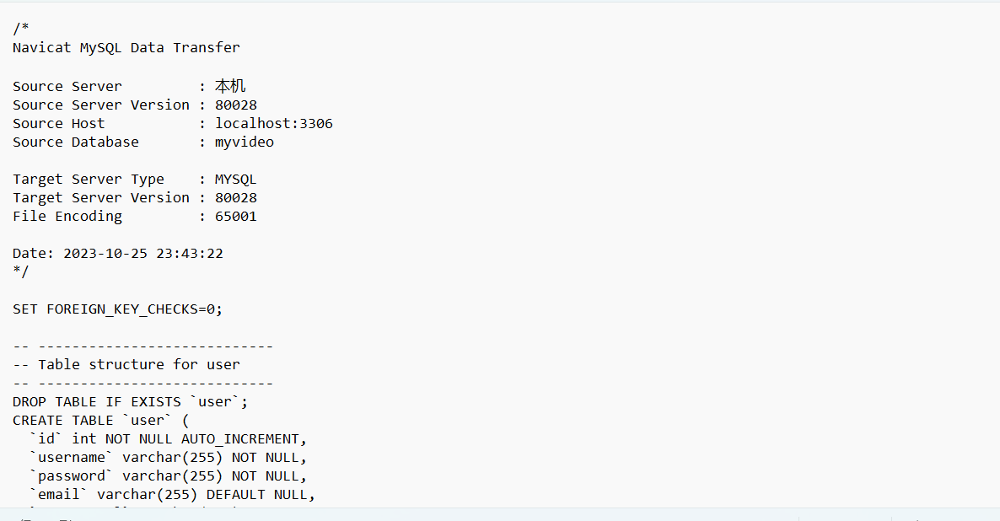
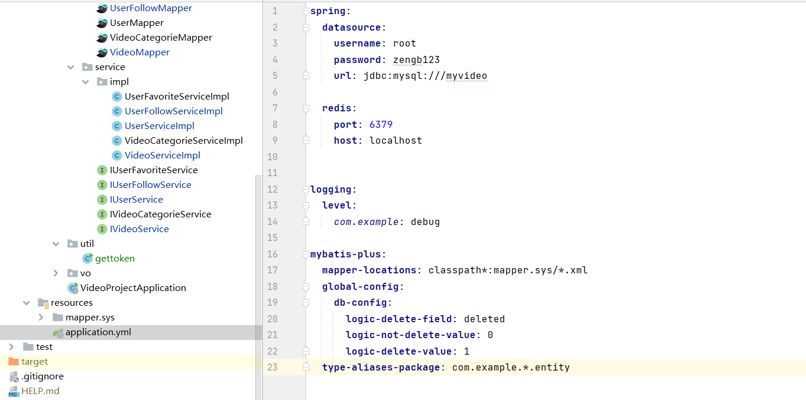
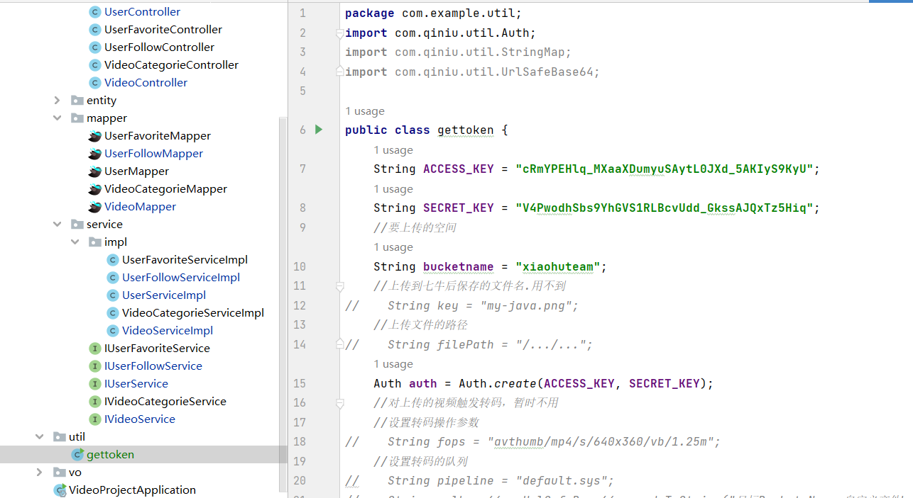

# ShortVideoPlayer
ShortVideoPlayer
# Vue 3 + Vite

This template should help get you started developing with Vue 3 in Vite. The template uses Vue 3 `<script setup>` SFCs, check out the [script setup docs](https://v3.vuejs.org/api/sfc-script-setup.html#sfc-script-setup) to learn more.

## Recommended IDE Setup

- [VS Code](https://code.visualstudio.com/) + [Volar](https://marketplace.visualstudio.com/items?itemName=Vue.volar) (and disable Vetur) + [TypeScript Vue Plugin (Volar)](https://marketplace.visualstudio.com/items?itemName=Vue.vscode-typescript-vue-plugin).

## 如何运行程序

导入数据库文件myvideo表

### 2，本地启动后端
配置数据库

配置token的密钥

可以启动后端服务
### 3，本地启动前端 
npm install 安装依赖
npm run dev  运行前端项目